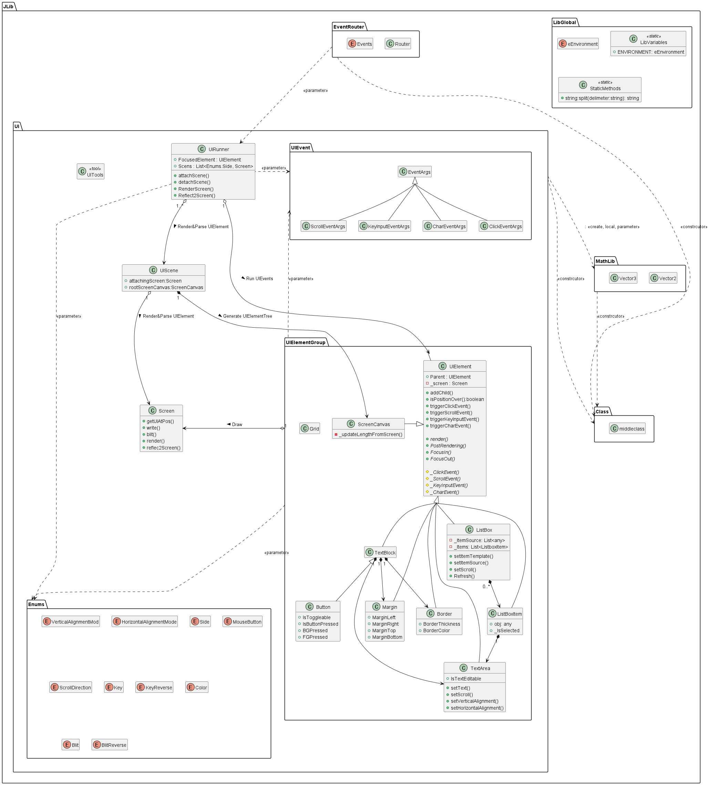

CC_JLib
===

Object-oriented Jiseok Library used in Computercraft, including various UI apis and classes.
Easy to use, optimized as possible

Features
---

- Various UI Elements, TextArea, Border, Margin, Textblock
- Easy to use UI Elements api, one-shot-rendering method
- Enrionment Variable & Namespace appiled to avoid name collision with other libraries
- Selection build to debug test functions in both Lua & ComputerCraft environments
- Require-based package modulation, faster than using dofile function
- TODO : Button API, Screen Scroll, Interactive UI API, Examples

Object Oriented Programming
---

In this repo, I used [middleclass](https://github.com/kikito/middleclass) apis for using OOP functions in lua languege.
middleclass is a powerful lua OOP library able to make class, inheritance, metamethods(operator overloading), class static variable(class variable) and weak mixin functions.
it is at [JLib/Class/middleclass.lua](./JLib/Class/middleclass.lua)

Packages
---

- **Class**
OOP library for lua. using middleclass.lua
- **LibGlobal**
Global variables and methods using in CC_JLib. Environment variables and global static methods like sting function overloading
- **MathLib**
Mathmetics library. Vector2, Vector3 is implemented
- **ReactorControl**
Controls BigReactors mode reactor. PI controller for control inner energy buffer.
- **Screentext**
very very simple api to display text on screen. like banners
- **UI**
all modules used in drawing & calculating UI

UI Elements
---

- **UIElement**  
Base class for UI elements. Cannot be used as instance alone.  
Contains basic properties for UIElement. You can make your own UIElement by inherit this class
  - Position, Relative Position, Length, Background & Foreground color
  - UIElement itself is a node of UI Rendering Tree, Rendering Children after renders itself
  - UI Event Bubbling Logic & abstract function for UIEvent handling  

- **Enums**  
All enums used in UI element & event in computercraft  
  - VerticalAlignmentMode
  - HorizontalAlignmentMode
  - Side
  - MouseButton
  - ScrollDirection
  - Direction
  - Key
  - KeyReverse
  - Color : with new Color.None(Transparent)
  - Blit
  - BlitReverse
- **UIEvent**  
Definitions of all UI interaction struct for computercraft  
  - mouse click
  - mouse scroll
  - key input
  - char input
  - monitor touch
- **UITools**  
Toolbox for UI position calculation, vector calculation, drawing function
- **UIScene**  
Composite Class of all UIElement in one screen, like a page.  
This is a base class for all UIScenes, you can make your own UIScene by inherit this class. UIScene Offers ProjectNamespace & AttachedScreen to child class.
- **UIRunner**  
Run the Multiple UIScenes with UIEvent Routing to target UIElement.  
Attach & Detach UIScene for each monitor or terminal. Recieves os.pullEvent() event with specific UIEvent, get UIElement at position, route UIEvent to clicked or touched UIElement's UIEvent handler function. Rednet message handing alse avilable.
- **Screen**  
Wrapper class of ComputerCraft's native screen.  
Render duplicated Screen buffer inside by UIElements. After all rendering finished, reflect internal screen buffer to actual CC's screen. This way removes jittering problem when render a new screen from the black, clean screen every time. Normally, screen rendering & reflecting occurs only when new UIEvent or Rednet messages handled. User can also manually trigger this procedure.
- **ScreenCanvas**  
Wrapper Basic UIElement of Screen class. Root node of each screen's UI Rendering Tree.  
Always follows the size of attached screen, propagates rendering function to all children.  
Length & relative position is depend on Screen
- **Grid**  
UI positioning tool for other UIElements. Similar with Grid in WPF
- **Margin**   
Add the margin to child UIElements.  
UIElement for positioning child UIElements.  
Length & relative position is depend on Parent UIElement
- **Border**  
Add the border to child UIElements. 
It does not pad or give margin to child UIElement. Just overdraw the border.   
Length & relative position is depend on Parent UIElement line to screen
- **TextArea**  
Text Showing, Align, Editting function area for parent UIElement.  
Can set Text, Edit text, align horizontally & vertically. Alse can be used as a text edittor when turn on the IsEdittable=True.  
Length & relative position is depend on Parent UIElement
- **TextBlock**  
Composite of Margin, Border, TextArea. Free to Edit relative position & Length
- **Button**  
Child class of Textblock, adding ToggleMode, change Colors when pressed.  
Triggers Click event when clicked or monitor touched
- **ListBox**  
Shows the internal custom table as the list of ListBoxItem UIElement.  
Can set internal custom table, make own display rule by set ItemTemplate function. Triggers event when SelectionChanged. 
- **ListBoxItem**  
Item container class of ListBox UIElement.  
- **ProgressBar**  
Display Progress in forms of Bar. Supports two direction : horizontal & vertical


How To Include
---

require [JLib/init.lua](./init.lua). JLib must be at /CC_JLib/JLib in absolute path in yout CC computer.
Than, include all UI Headers(modules) by includeing UI.Include.lua

**example code**

```lua
-- register package.path CC_JLib path
require("CC_JLib.JLib.init")

-- include all UI modules in CC_JLib
require("UI.Include")
```

init.lua file has one local variable to select your running environment.
In init.lua, Also you can add new Environment number of your own

**Init.lua**

```lua
-- select your environment
-- 0 : jasuk500, 1 : CC, 2 : replit.com
local environment = 0

if (environment == 0) then
    -- in another env
    package.path = package.path .. ";D:/lua/CC_JLib/JLib/?.lua"
    package.path = package.path .. ";/home/jisuk500/asdf/CC_JLib/JLib/?.lua"

    require("LibGlobal.LibVariables")
    JLib.LibVariables.static.ENVIRONMENT =
        JLib.LibVariables.static.eENVIRONMENT.Lua

elseif (environment == 1) then
    -- CC env
    package.path = package.path .. ";CC_JLib/JLib/?.lua"

    require("LibGlobal.LibVariables")
    JLib.LibVariables.static.ENVIRONMENT =
        JLib.LibVariables.static.eENVIRONMENT.CC

elseif (environment == 2) then
    -- replit env
    package.path = package.path .. ";/home/runner/CCsource/JLib/?.lua"

    require("LibGlobal.LibVariables")
    JLib.LibVariables.static.ENVIRONMENT =
        JLib.LibVariables.static.eENVIRONMENT.Lua

end
```

UI APIs
---

- UIElement
abstract class for all UI element, virtual function 'render()' is included


Class Diagram
---
